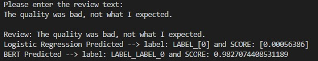

# Women-Fashion-Review-Classification

![Python version][python-version]
![Latest version][latest-version]
[![GitHub forks][fork-image]][fork-url]
[![GitHub Stars][stars-image]][stars-url]
[![License][license-image]][license-url]

This is a project to improve an e-commerce platform feedback system by building an NLP system that can automatically analyze product reviews to extract valuable insights. We will build a system that can predict if a product will be recommended based on customer review. Recommend (1) / Not Recommend (0).

## Tree Structure

```zsh
├── __pycache__
├── dataset
│   ├── Womens Clothing E-Commerce Reviews.csv
│   └── data_X_train.csv
├── models
│   ├── Random Forest_v1.joblib
│   ├── XGBoost_v1.joblib
│   ├── logreg_v1.joblib
│   └── tfidf_fit_transform.joblib
├── README.md
├── Result.jpeg
├── inference.py
├── main.py
├── notebook_development.ipynb
├── inference.py
├── preprocessing.py
└── requirements.txt
```

## Initial setup
First thing to do is to create or change directories into wherever you keep all of your projects.
Lert say, the `Projects` folder.
Once there clone this repo.

```zsh
(efrad) ➜ cd Projects
(efrad) ➜ git clone <https://github.com/Efradgalio/Women-Fashion-Review-Classification.git>
(efrad) ➜ cd Women-Fashion-Review-Classification
```
## Anaconda setup
If you are an Anaconda user, this command will get you up to speed with the base installation.

```zsh
(efrad) ➜ conda create --name women_fashion_classification -file requirements.txt
(efrad) ➜ conda activate women_fashion_classification
```

## Regular Python setup
If you are just using normal Python, this will get you ready.
First thing is to create a virtual environment. There are many ways to do this, but the simplest is using `venv`.

```zsh
(efrad) ➜ python3 -m venv venv
(efrad) ➜ source venv/bin/activate
(venv) ➜ pip install -r requirements.txt
```
## Running the App
Running the `main.py`:
```commandline
(women_fashion_classification) ➜ python main.py
```

## Input and Output
After running the code, you will be ask to input the review text.
Then, there will be 2 predictions output from Logistic Regression and BERT as shown below.



## License

Distributed under the terms of the [MIT](https://opensource.org/licenses/MIT) license, "Women-Fashion-Review-Classification" is free and open source software.

## Issues

If you encounter any problems, please [file an issue](https://github.com/Efradgalio/Women-Fashion-Review-Classification/issues) along with a detailed description.

[python-version]:https://img.shields.io/badge/python-3.11.9-brightgreen.svg
[latest-version]:https://img.shields.io/badge/version-1.0.0-blue.svg
[fork-image]:https://img.shields.io/github/forks/Efradgalio/Women-Fashion-Review-Classification
[fork-url]:https://github.com/Efradgalio/Women-Fashion-Review-Classification/network
[stars-image]:https://img.shields.io/github/stars/Efradgalio/Women-Fashion-Review-Classification
[stars-url]:https://github.com/Efradgalio/Women-Fashion-Review-Classification/stargazers
[license-image]:https://img.shields.io/github/license/Efradgalio/Women-Fashion-Review-Classification
[license-url]:https://github.com/Efradgalio/Women-Fashion-Review-Classification/blob/main/LICENSE

